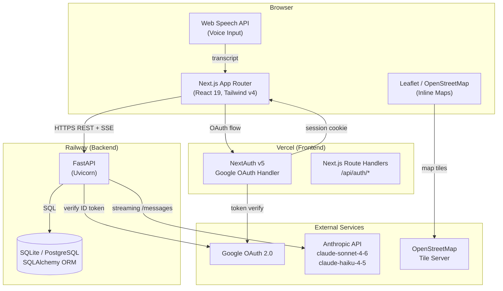
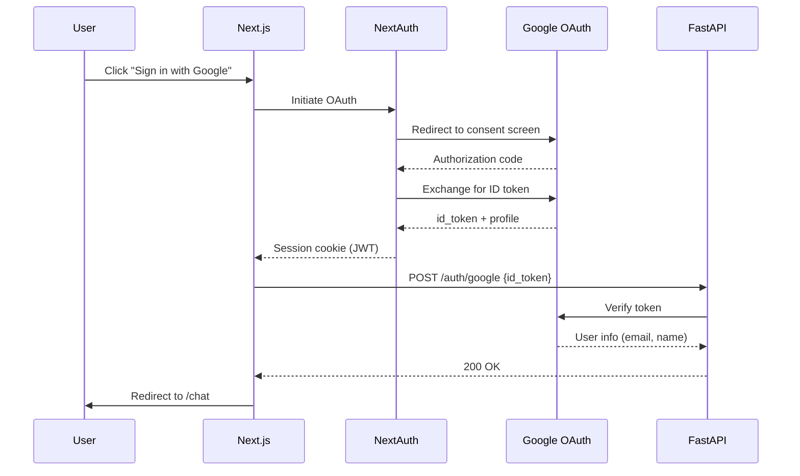
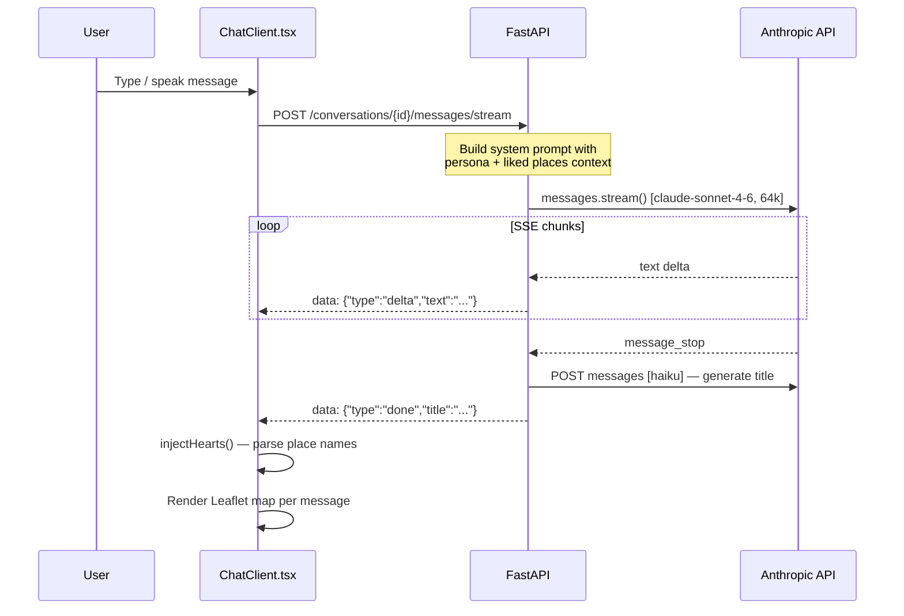
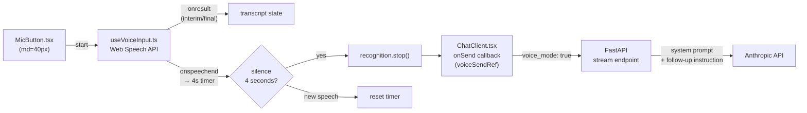
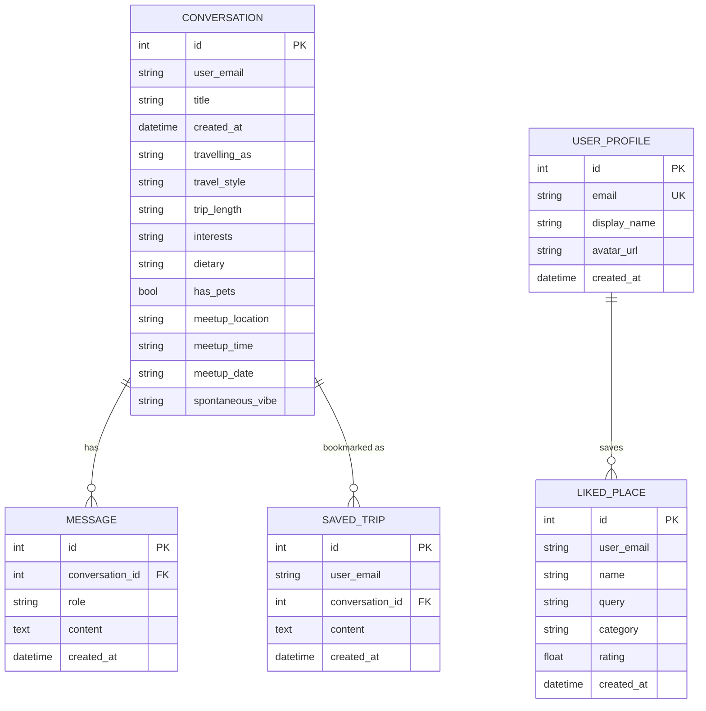
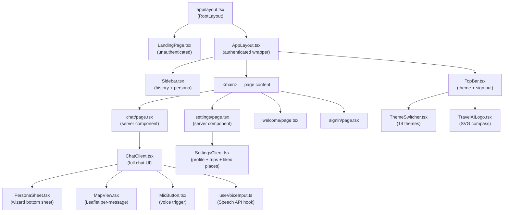
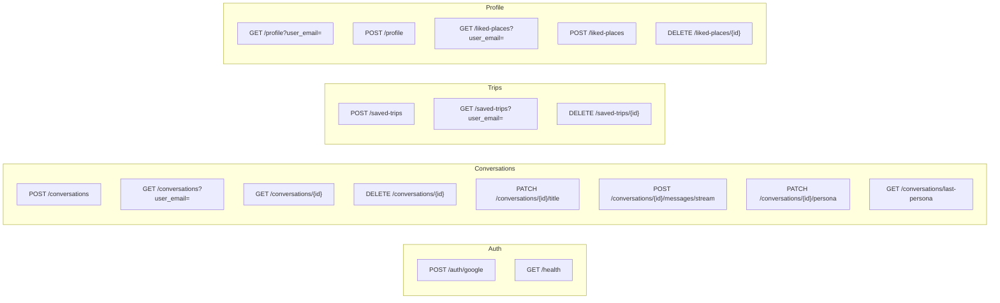
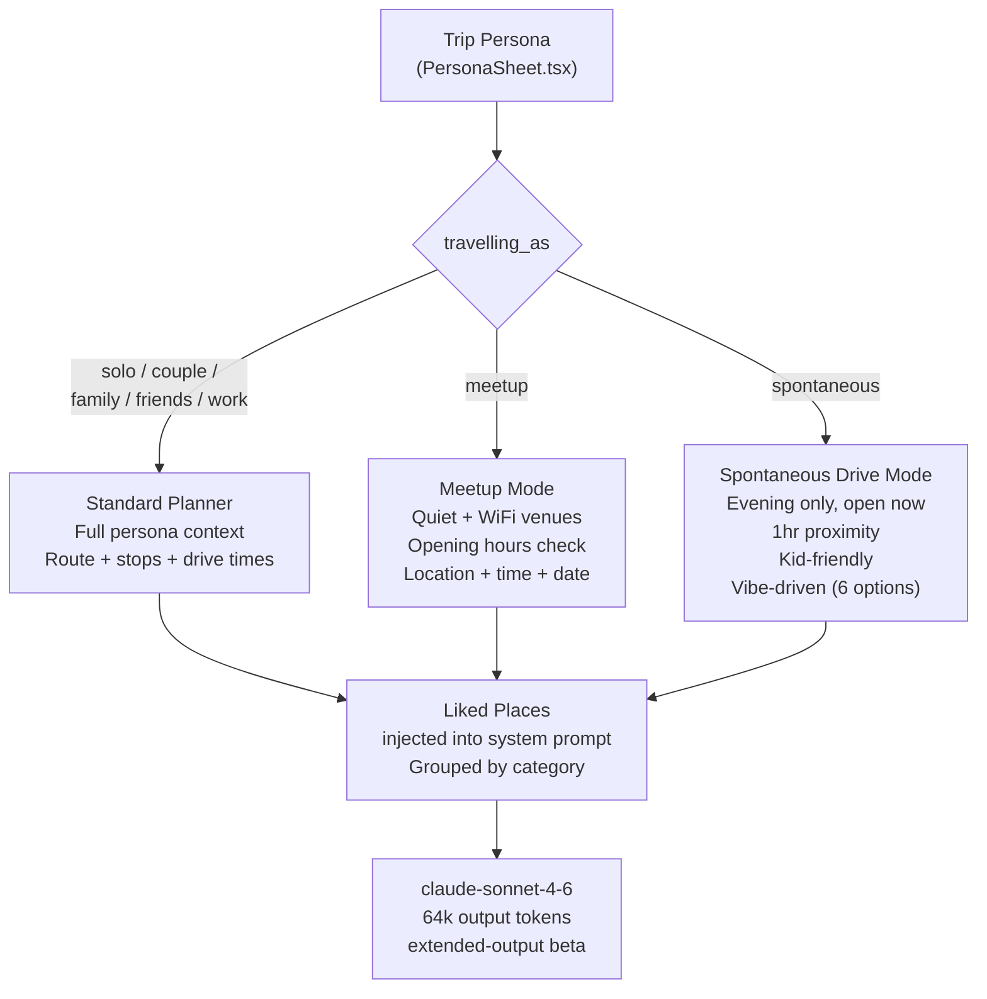
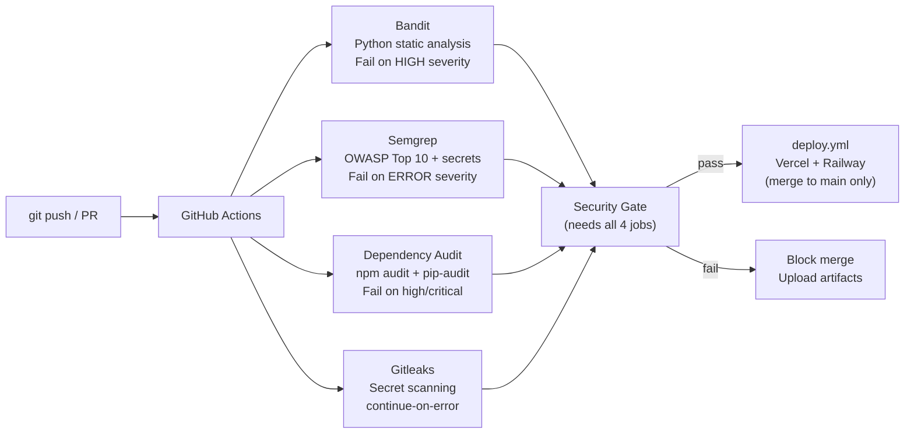

# TravelAI — Architecture

## Tech Stack

| Layer | Technology | Version |
|-------|-----------|---------|
| **Frontend Framework** | Next.js (App Router, Turbopack) | 16.2.1 |
| **UI Library** | React | 19.2.4 |
| **Styling** | Tailwind CSS | v4 |
| **Auth (Frontend)** | NextAuth | v5.0.0-beta.30 |
| **Maps** | Leaflet + React-Leaflet / OpenStreetMap | 1.9.4 / 5.0.0 |
| **Markdown** | react-markdown + remark-gfm | 10.1.0 |
| **Language** | TypeScript | v5 |
| **Backend Framework** | FastAPI + Uvicorn | 0.115.0 / 0.30.6 |
| **ORM** | SQLAlchemy | 2.0.36 |
| **Database (local)** | SQLite | — |
| **Database (prod)** | PostgreSQL | — |
| **Auth (Backend)** | Google Auth Library | 2.35.0 |
| **AI Provider** | Anthropic API | SDK 0.40.0 |
| **Chat Model** | claude-sonnet-4-6 | 64k output tokens |
| **Title Model** | claude-haiku-4-5 | — |
| **Frontend Deploy** | Vercel | — |
| **Backend Deploy** | Railway | — |
| **CI/CD** | GitHub Actions | — |
| **Security** | Bandit + Semgrep + Gitleaks + pip-audit + npm audit | — |

---

## System Architecture

---

## Authentication Flow

---

## Chat & SSE Streaming Flow

---

## Voice Input Flow

---

## Database Schema (ER Diagram)

---

## Frontend Component Hierarchy

---

## API Endpoints

---

## Persona Modes & AI Prompt Routing

---

## CI/CD & Security Pipeline

